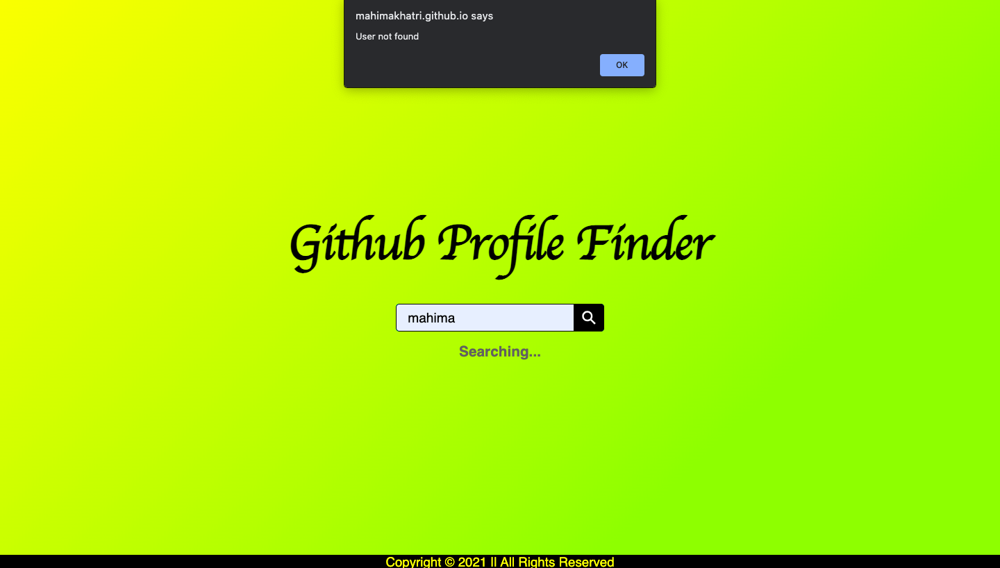

  
# Github Profile Finder :monocle_face:
  
  

In this project, we can search GitHub users by their username. The search query returns the user's profile information along with the list of repositories present in the profile.

Live Demo : https://mahimakhatri.github.io/Github-Profile-Finder/

## Features :eyes:
### Home Page

### User Search

### Search Result

### User Not Found

## Tech Stack :desktop_computer:

+ Html 
+ CSS
+ JavaScript
+ BootStrap

## Developer :woman_technologist:
<table>
<td>

Mahima Khatri

</td>
</tr>
</table>
